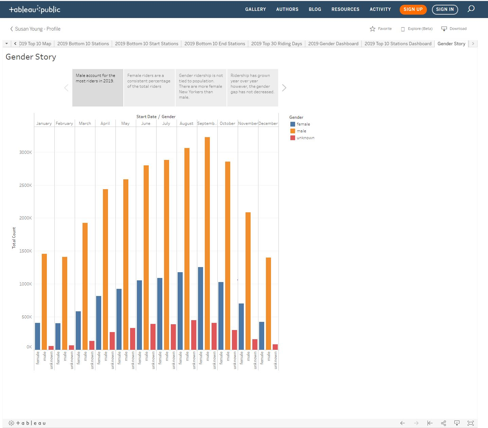
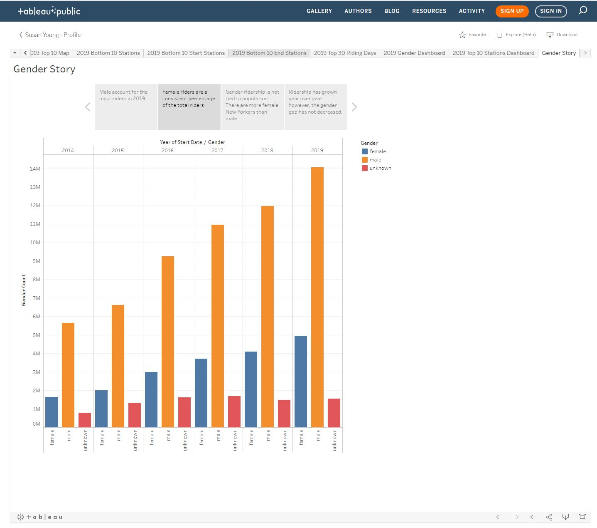
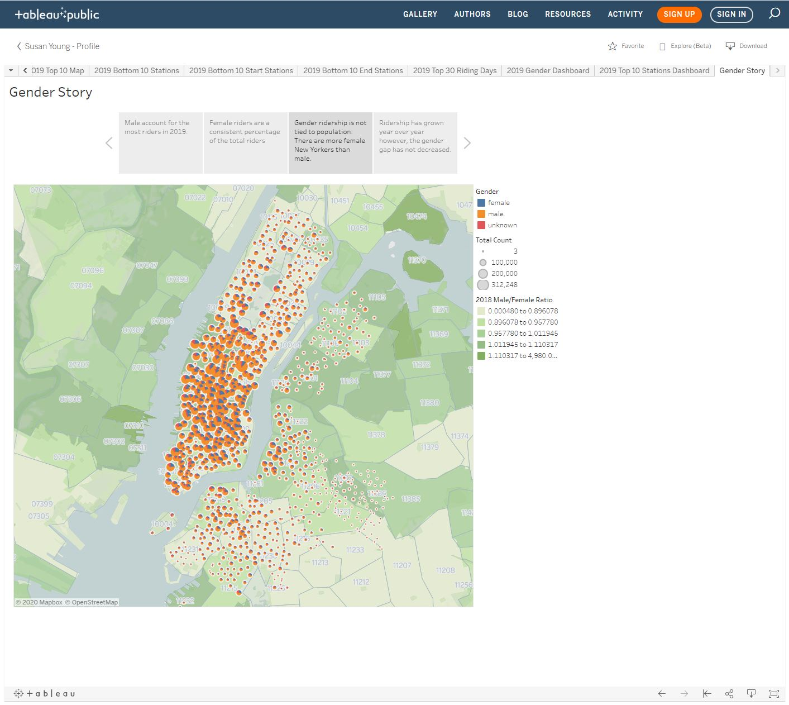

### Susan Young

# CitiBike Analysis

# Dataset: https://www.citibikenyc.com/system-data

Analyze Gender trends over 2014 - 2019. 
Analyze station start/end volume for 2019.

# Final analysis:
 
  * Source is located in Tableau public: https://public.tableau.com/profile/susan.young
  * The top 10 stations are all within 1 mile of each other
  * The top 10 starting are also the top 10 ending stations
  * Males riders account for most Citibike riders
  * The gender gap in ridership has not improved over the life of the program. 

### Technologies

1. **Python**
2. **Excel**
3. **Pandas**
4. **Tableau**

# Table of Contents

1. 2019 Rides by Month & Gender
2. Rides by Year & Gender
3. 2019 Map Station Gender Pie
4. 2019 Map Station Rides
5. 2019 Top 10 Stations
6. 2019 Top 10 Start Stations
7. 2019 Top 10 End Stations
8. 2019 Bottom 10 Stations
9. 2019 Bottom 10 Start Stations
10. 2019 Bottom 10 End Stations
11. 2019 Top 30 Riding Days
12. 2019 Gender Dashboard
13. 2019 Top 10 Stations Dashboard
14. Gender Story

